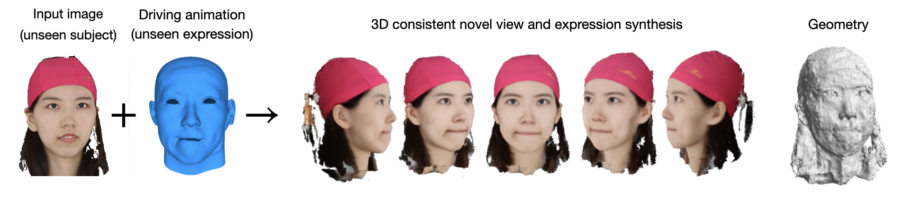
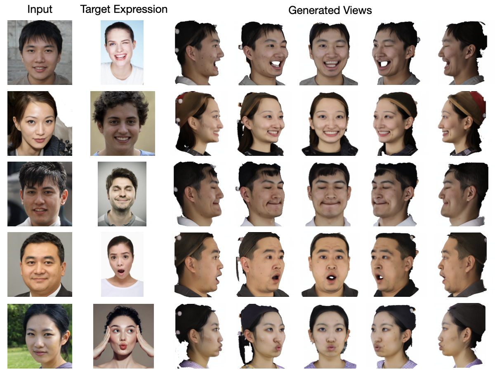

# Morphable Diffusion (CVPR 2024)
Morphable Diffusion: 3D-Consistent Diffusion for Single-image Avatar Creation





## [Project page](https://xiyichen.github.io/morphablediffusion) | [Paper](https://arxiv.org/abs/2401.04728)

### TODOs:
- [x] Release pretrained model and inference script for the face model
- [x] Release pretrained face model with bilinear meshes and evaluation code
- [ ] Release pretrained model, inference script, and evaluation code for the full body model
- [ ] Retrain face model with flame meshes obtained from more accurate FLAME-tracking.

### Instructions
- See [installation](docs/installation.md) to install all the required packages
- See [data preparation](docs/data.md) to set up the download pretrained models, assets and datasets
- See [evaluation](docs/eval.md) to reproduce the qualitative and quantitative results in our paper

### Inference
To run Morphable Diffusion for novel facial expression synthesis, replace `$INPUT_IMG` and `$TARGET_EXPRESSION_IMG` with paths to the input image and target facial expression image and run:
```bash
bash generate_face.sh
```

### Training
We train our models using 2 80GB NVIDIA A100 GPUs with a total batch size of 140.
#### Train the face model:
```bash
bash train_face.sh
```
Please pay attention to the following arguments in `configs/facescape.yaml`:

`data_dir`: path to the preprocessed FaceScape data

`finetune_unet`: Whether to finetune the UNet along with the conditioning module.

`mesh_topology`: The topology of the face mesh used for training (Choose between `flame` and `bilinear`).

`shuffled_expression`: Whether to use different facial expressions for the input and target views. (Discussed in section 4.2 of the paper)

#### Train the full body model:
```bash
bash train_body.sh
```

Please pay attention to the following arguments in `configs/thuman.yaml`:

`data_dir`: path to the preprocessed Thuman 2.1 data.

`smplx_dir`: path to the SMPL-X meshes of the Thuman 2.1 dataset.

`finetune_unet`: Whether to finetune the UNet along with the conditioning module.


During training, we will run validation to output images to `<log_dir>/<images>/val` every 250 steps.

## Acknowledgement

We have intensively borrow codes from the following repositories. Many thanks to the authors for sharing their codes.

- [SyncDreamer](https://github.com/liuyuan-pal/SyncDreamer)
- [neuralbody](https://github.com/zju3dv/neuralbody)
- [DINER](https://github.com/malteprinzler/diner)
- [MICA](https://github.com/Zielon/MICA)
- [metrical-tracker](https://github.com/Zielon/metrical-tracker.git)

## Citation
If you find this repository useful in your project, please cite the following work. :)
```
@article{chen2024morphable,
         title={Morphable Diffusion: 3D-Consistent Diffusion for Single-image Avatar Creation}, 
         author={Xiyi Chen and Marko Mihajlovic and Shaofei Wang and Sergey Prokudin and Siyu Tang},
         booktitle={IEEE Conference on Computer Vision and Pattern Recognition (CVPR)},
         year={2024}
      }
```
